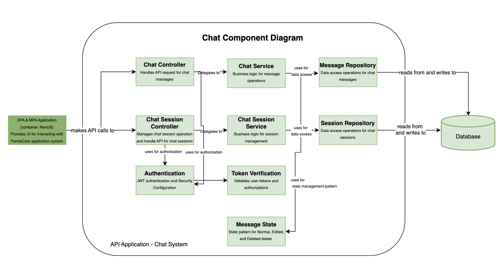
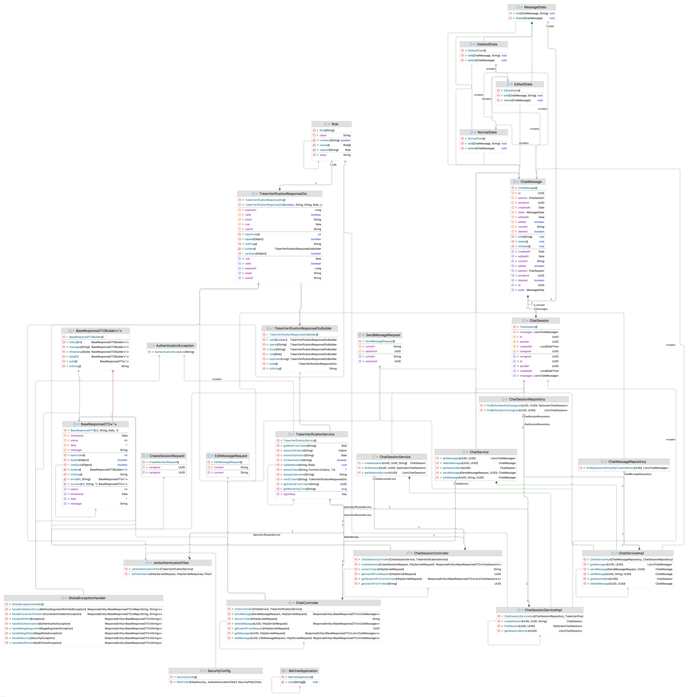

# PandaCare  – 💬 Fitur Chat antara Pacillians and CareGiver

- BeChat adalah microservice untuk menangani fitur percakapan (chat) antara dua pengguna, seperti pasien (Pacillians) dan dokter (CareGiver)
---
#### Fitur Chat antara Pacillians and CareGiver
*Developed by: Cleo Excellen Iskandar*
- Component Diagram
  
- Code Diagram
  

## Deployment

Link: [BE-Chat Deployment](http://54.158.239.145/)
Link: [Postman API](https://www.postman.com/api-ristek/workspace/adprochat/collection/38268031-7f8b0afc-a091-4e9d-9439-8d1736072df7?action=share&creator=38268031)

## 🚀 Fitur Utama

Melakukan chat antara pengguna dan dokter,  terdiri dari use cases sebagai berikut.
- User dan dokter dapat saling mengirim pesan (C)
- dokter dapat memberikan saran medis melalui chat (C)
- Melihat Riwayat Chat: User dan Dokter dapat melihat riwayat pesan yang pernah dikirim dan diterima sebelumnya. (R)
- Mengubah Pesan: User dan Dokter dapat mengubah isi pesan yang sudah dikirim, dan pesan tersebut akan diberi label bahwa telah diedit. (U)
- Menghapus Pesan: User dan Dokter dapat menghapus pesan yang sudah dikirim. Pesan yang dihapus tetap ada di database namun diberi tanda "Pesan telah dihapus". (D)

---

## 📁 Arsitektur Proyek (Layered Architecture Pattern)

Aplikasi ini menggunakan pendekatan **Layered Architecture** yang memisahkan tanggung jawab menjadi beberapa lapisan:

1. **Controller Layer**
   - Mengatur route dan menerima HTTP request
   - `ChatController`, `ChatSessionController`

2. **Service Layer**
   - Menangani business logic
   - `ChatService`, `ChatServiceImpl`, `ChatSessionService`, `ChatSessionServiceImpl`

3. **Repository Layer**
   - Abstraksi akses ke database via Spring Data JPA
   - Contoh: `ChatMessageRepository`, `ChatSessionRepository`

4. **Model Layer (Entity)**
   - Representasi entitas dalam database
   - Contoh: `ChatMessage`, `ChatSession`

5. **DTO Layer**
   - Data Transfer Object untuk validasi input
   - Contoh: `SendMessageRequest`, `CreateSessionRequest`, `EditMessageRequest`

---

## 💡 Design Pattern yang Digunakan

### 🧠 State Pattern

## 📦 API Endpoint

### 🔗 Session
| Method | Endpoint                                                              | Description                                         |
|--------|-----------------------------------------------------------------------|-----------------------------------------------------|
| POST   | `/chat/session/create`                                                | Membuat sesi chat antara dua user                   |
| POST   | `/chat/send`                                                          | Mengirim atau membuat pesan baru                    |
| GET    | `/chat/session/find?user1={userId1}&user2={userId2}`                  | Mencari sesi antara dua pengguna                    |
| GET    | `/chat/session/user/{userId}`                                         | Mencari semua sesi chat yang dimiliki seorang user  |
| GET    | `/chat/session/{sessionId}`                                           | Mendapatkan semua pesan dalam satu sesi chat        |
| PUT    | `/chat/message/{messageId}`                                           | Mengedit isi pesan berdasarkan `messageId`          |
| DELETE | `/chat/message/{messageId}`                                           | Menghapus pesan berdasarkan `messageId`             |